# metro-crash-bi

> End-to-end BI pipeline integrating motor vehicle collision records across NYC, Chicago & Austin — ydata profiling, Talend ETL, star schema dimensional model, SQL Server

---

## Overview

**metro-crash-bi** is a multi-city business intelligence platform analyzing motor vehicle collisions across New York City, Chicago, and Austin. Crash data was sourced from each city's Department of Transportation and harmonized into a unified dimensional model to support analysis of accident hotspots, temporal trends, injury patterns, and contributing factors.

---

## Repository Structure

```
metro-crash-bi/
├── talend/                         # Talend Cloud Data Fabric ETL jobs
│   └── jobs/
│       ├── context/
│       ├── metadata/
│       └── process/
├── data-analysis/                  # ydata profiling notebooks
│   ├── austin-crashes-profiling.ipynb
│   ├── chicago-crashes-profiling.ipynb
│   ├── nyc-crashes-profiling.ipynb
│   └── data-analysis-report.docx
├── lookup-files/                   # Reference/lookup tables used in ETL
│   ├── austin-contributing-factors.xlsx
│   ├── chicago-contributing-factors.xlsx
│   ├── contributing-factors-generalized.xlsx
│   ├── nyc-contributing-factors.xlsx
│   ├── nyc-contributing-factors-v2.xlsx
│   ├── nyc-vehicle-types.xlsx
│   ├── nyc-vehicle-types-raw.xlsx
│   └── vehicle-type-codes.xlsx
├── powerbi/                        # Power BI dashboards (.pbix)
│   ├── accident-frequency-by-city.pbix
│   ├── accident-hotspot-map.pbix
│   ├── injury-accidents-overall.pbix
│   ├── injury-accidents-by-city.pbix
│   ├── pedestrian-accidents-overall.pbix
│   ├── pedestrian-accidents-by-city.pbix
│   ├── temporal-trends.pbix
│   ├── motorist-injuries-fatalities.pbix
│   ├── top-accident-streets.pbix
│   ├── fatalities-by-road-user-type.pbix
│   ├── contributing-factors-analysis.pbix
│   └── multi-vehicle-crashes.pbix
├── tableau/                        # Tableau workbook
│   └── crash-analysis.twb
├── data-model/                     # Dimensional model
│   └── crash-star-schema.DM1
├── assets/                         # Images for README
│   ├── star-schema.png
│   ├── austin-mapping-table.png
│   ├── chicago-mapping-table.png
│   ├── nyc-mapping-table.png
│   ├── austin-01-prestaging.png
│   ├── austin-02-data-processing.png
│   ├── austin-03-data-processing-2.png
│   ├── austin-04-normalization.png
│   ├── austin-05-vehicle-normalize.png
│   ├── austin-06-cf-lookup.png
│   ├── chicago-01-prestaging.png
│   ├── chicago-02-processing-1.png
│   ├── chicago-03-processing-2.png
│   ├── chicago-04-processing-3.png
│   ├── chicago-05-processing-final.png
│   ├── nyc-01-prestaging.png
│   ├── nyc-02-stg-processing.png
│   ├── nyc-03-normalization.png
│   ├── nyc-04-cf-lookup.png
│   ├── nyc-05-vehicle-type-lookup.png
│   └── nyc-06-processing-finale.png
├── docs/                           # Project documentation
│   ├── final-report.pdf
│   └── mapping-document.pdf
├── LICENSE
└── README.md
```

---

## Data Sources

| City | Source | Records | Date Range |
|---|---|---|---|
| New York City | NYPD Motor Vehicle Collisions (MV-104AN) | ~1.9M | 2012–2024 |
| Chicago | Chicago Data Portal — Traffic Crashes | ~800K | 2013–2024 |
| Austin | TxDOT CRIS Database via Austin Transportation & Public Works | ~200K | 2014–2024 |

---

## Architecture

### ETL Pipeline (Talend Cloud Data Fabric 8.0.1)

Each city follows a multi-job ETL pipeline with the following pattern:

1. **Pre-staging** — Ingest raw delimited files with dynamic date-based file paths
2. **Data processing** — Format dates, handle nulls, add city identifiers
3. **Normalization** — Concatenate and deduplicate contributing factors; normalize vehicle types
4. **Lookup enrichment** — Resolve contributing factor codes and vehicle type codes to descriptions
5. **Load** — Write to final staging tables in SQL Server

| City | Jobs |
|---|---|
| Austin | 6 jobs (pre-staging → CF lookup) |
| Chicago | 5 jobs (pre-staging → CF lookup) |
| NYC | 6 jobs (pre-staging → vehicle type lookup) |

---

## ETL Job Diagrams

### Austin City Pipeline

Austin's pipeline ingests raw crash data from the TxDOT CRIS database, processes and normalizes contributing factors and vehicle types across 6 sequential jobs, and loads records into a SQL Server staging table.

**Job 1 — Pre-Staging** (`Austin_jobb`): Orchestrates file ingestion with a PreJob/PostJob pattern. Uses `tSetGlobalVar` to resolve the dynamic date-based file path, sends email notifications on completion, and routes errors through `tLogCatcher`.

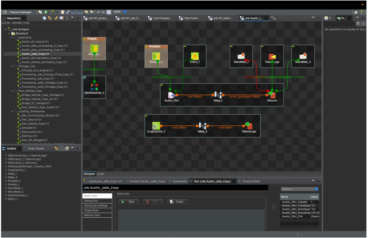

**Job 2 — Data Processing** (`Austin_data_processing_Copy`): Reads from `austin_pre_staging` and maps to `Austin_p_part1`. Formats `crash_date` to `MM/dd/yy`, handles nulls for all injury/death count columns, and hardcodes `City = "Austin"`.

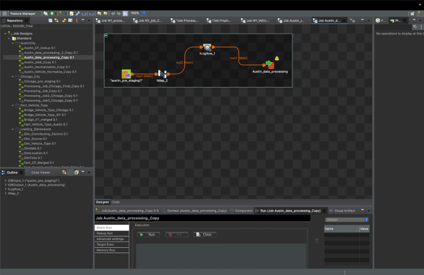

**Job 3 — Data Processing 2** (`Austin_data_processing_2_Copy`): Reads from `Austin_p_part1` into `Austin_p_part2`. Handles null values for `latitude`, `longitude`, `contrib_factr_p1_id`, and `contrib_factr_p2_id`.

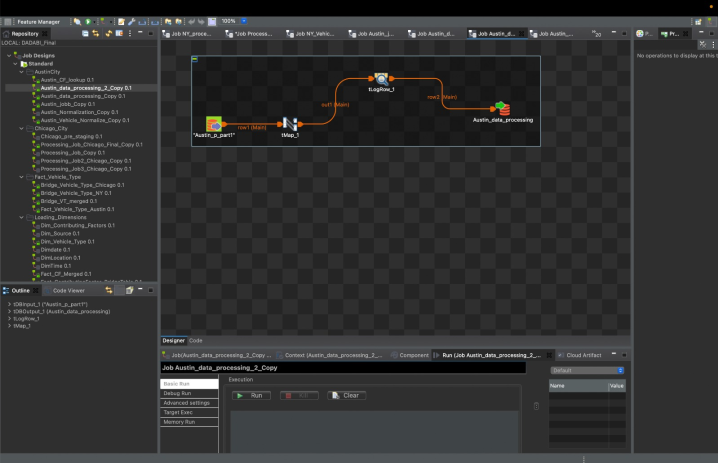

**Job 4 — Normalization** (`Austin_Normalization_Copy`): Concatenates `contrib_factr_p1_id` and `contrib_factr_p2_id` into a single normalized string, deduplicates contributing factor values, and filters out empty entries.

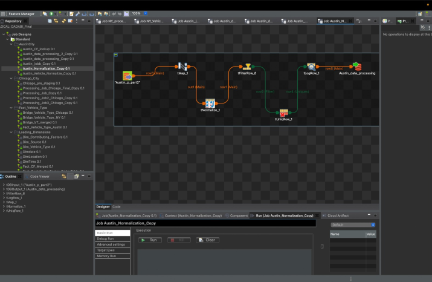

**Job 5 — Vehicle Type Normalization** (`Austin_Vehicle_Normalize_Copy`): Normalizes the `units_involved` column across multiple `tMap` stages, trims whitespace, and replaces null vehicle types with `"Other/Unknown"`.

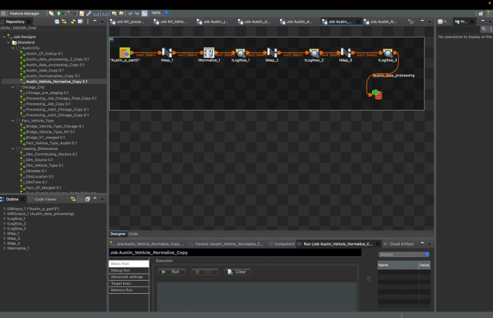

**Job 6 — Contributing Factor Lookup** (`Austin_CF_lookup`): Joins `Austin_p_part4` against the `Austin_Lookup_CF` Excel file via `tMap` to resolve `Contributing_Factor_Description`. Assigns `"other"` to any unmatched codes.

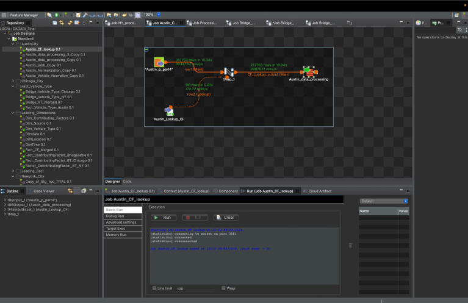

---

### Chicago City Pipeline

Chicago's pipeline ingests raw crash records from the Chicago Data Portal, processing 5 sequential jobs to normalize injury fields, contributing causes, and vehicle types before loading to SQL Server.

**Job 1 — Pre-Staging** (`Chicago_pre_staging`): Orchestrates ingestion of the Chicago delimited file with a PreJob/PostJob pattern. Uses `tSetGlobalVar` for dynamic file paths, `tSendMail` for notifications, and `tLogCatcher` for error handling.

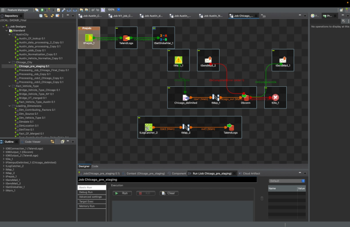

**Job 2 — Processing 1** (`Processing_Job_Copy`): Maps `Chicago_pre_staging` to `Chicago_p_part1`. Formats `CRASH_DATE`, handles nulls for `STREET_NAME`, `LATITUDE`, `LONGITUDE`, `WEATHER_CONDITION`, and hardcodes `City = "Chicago"`.

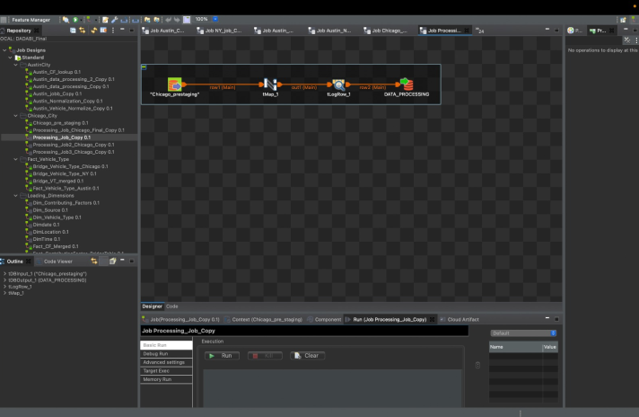

**Job 3 — Processing 2** (`Processing_Job2_Chicago_Copy`): Moves data from `Chicago_p_part1` to `Chicago_p_part2`. Defaults all injury/fatality/pedestrian/cyclist/motorist counts to `0` (these fields do not exist in the source), and assigns `Vehicle_Type = "Other/Unknown"` for nulls.

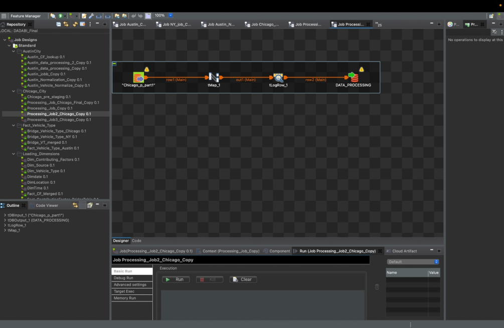

**Job 4 — Processing 3** (`Processing_Job3_Chicago`): Concatenates `PRIM_CONTRIBUTORY_CAUSE` and `SEC_CONTRIBUTORY_CAUSE` into a normalized contributing factor string, deduplicates, and handles nulls by defaulting to `"NA"`. Also re-handles `LATITUDE` and `LONGITUDE` nulls.

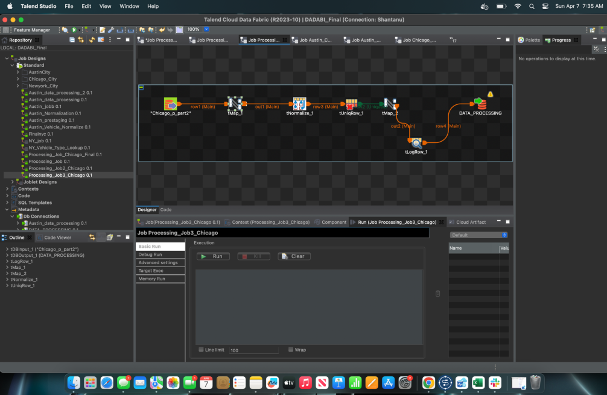

**Job 5 — Final Processing with CF Lookup** (`Processing_Job_Chicago_Final_Copy`): Joins `Chicago_p_part3` against the `Lookup_file_Chicago` Excel file to resolve contributing factor codes. Processed 1.35M rows at ~29K rows/sec. Assigns `"other"` to unmatched codes.

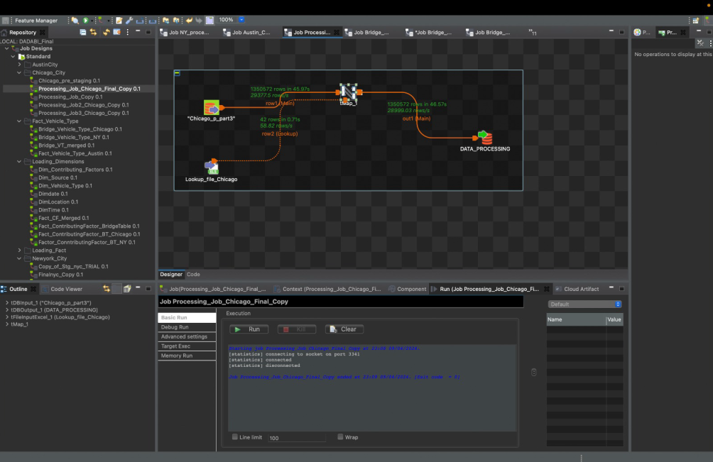

---

### New York City Pipeline

NYC's pipeline handles the largest dataset (~1.9M rows), processing 6 jobs to normalize contributing factors across 5 vehicle columns, standardize vehicle types via a custom lookup, and derive crash hour before final load.

**Job 1 — Pre-Staging** (`NY_job_Copy`): Orchestrates ingestion of the NYC delimited TSV file. Uses PreJob/PostJob orchestration, `tSetGlobalVar` for dynamic date-based file path, `tSendMail` for notifications, and `tLogCatcher` for error routing.

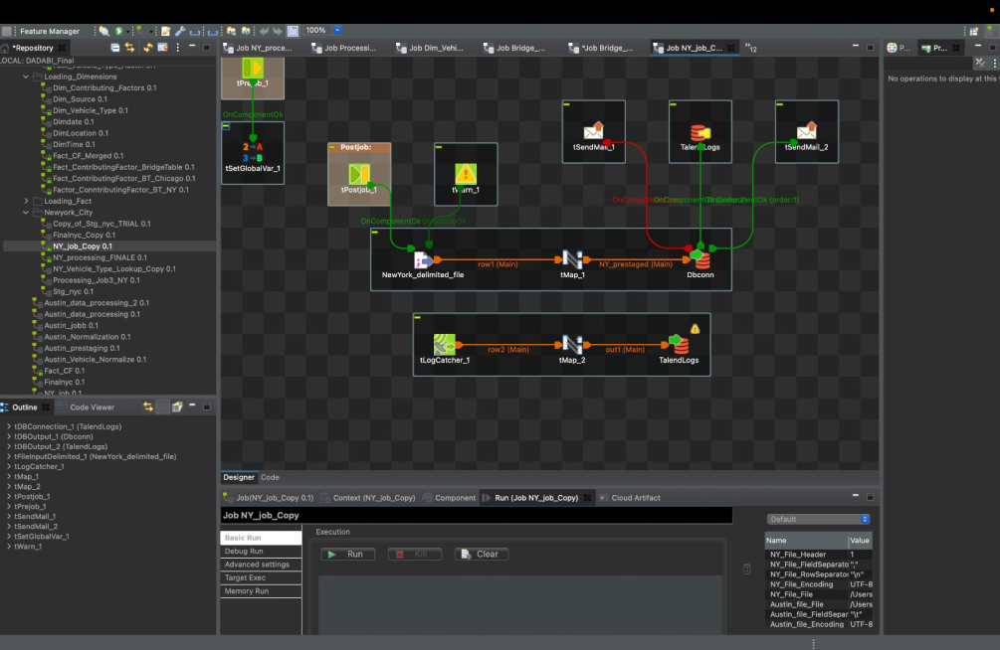

**Job 2 — Staging Processing** (`Copy_of_Stg_nyc_TRIAL`): Reads `NY_pre_staging` into `NY_p_part1`. Checks all injury/killed columns for valid digits, handles nulls with default `0`, formats `CRASH_DATE`, derives `ON_STREET_NAME` with `"NA"` fallback, and hardcodes `City = "New York"`.

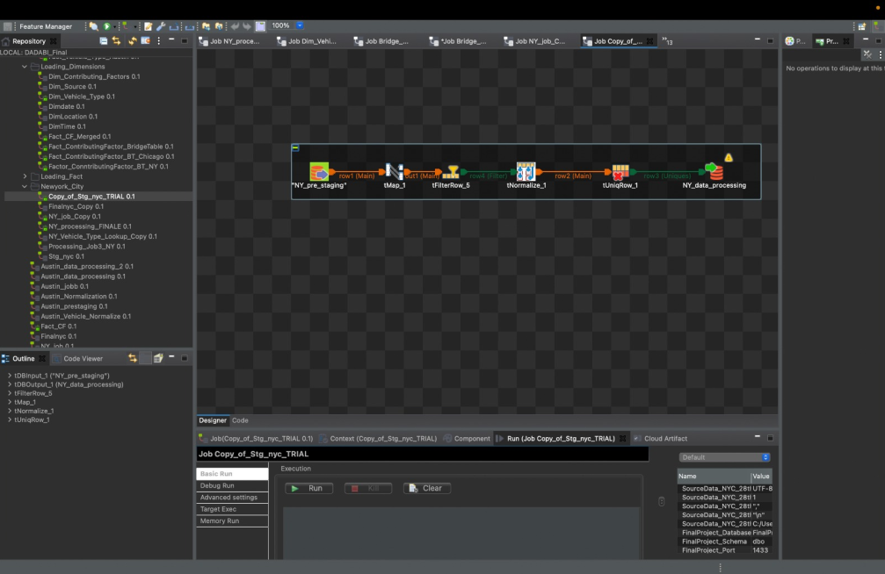

**Job 3 — Normalization** (`Finalnyc_Copy`): Maps `NY_p_part1` to `NY_p_part2`. Concatenates `CONTRIBUTING_FACTOR_VEHICLE 1–5` fields into a single semicolon-delimited string, defaults empty results to `"NA"`, and merges `VEHICLE_TYPE_CODE 1–5` into one column.

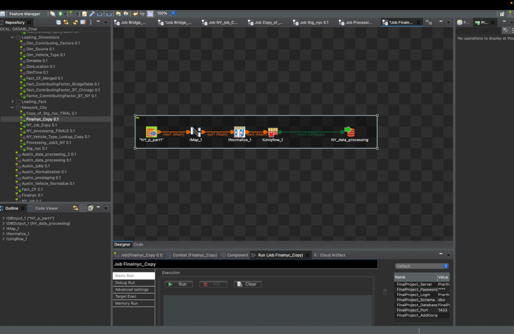

**Job 4 — Contributing Factor Lookup** (`Processing_Job3_NY`): Joins `NY_p_part2` against the custom `Lookup_NY` Excel file to resolve contributing factor codes and descriptions. Assigns code `101` / description `"other"` to all unresolvable values.

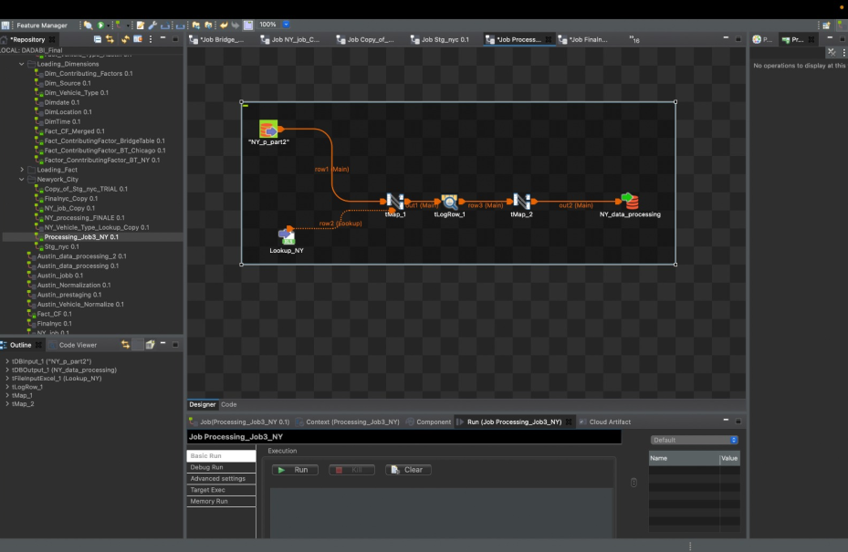

**Job 5 — Vehicle Type Lookup** (`NY_Vehicle_Type_Lookup_Copy`): Joins `NY_p_part3` against `LookUp_Vehicle_Type_NY` to standardize vehicle type codes to generalized categories aligned with Austin's classification scheme.

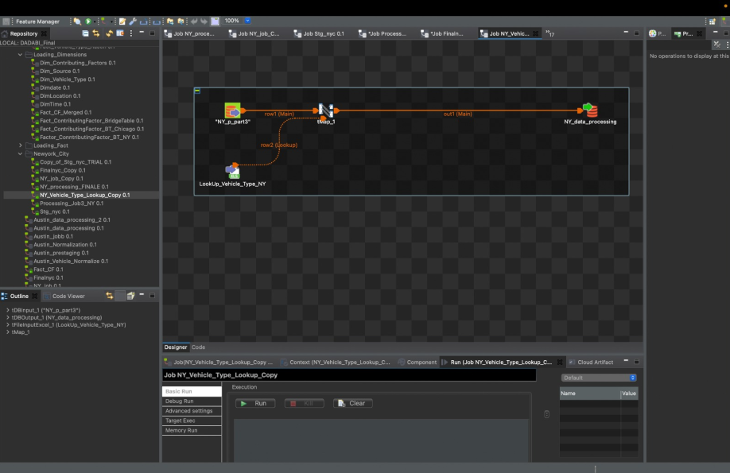

**Job 6 — Final Processing** (`NY_processing_FINALE`): Final single-step job that processes `NY_p_part4` (4.94M rows) through a `tMap` to produce `NY_data_processing`. Derives `Crash_Hour` from `Crash_Time` and adds `Vehicle_Type_Category`. Processed at ~30K rows/sec.

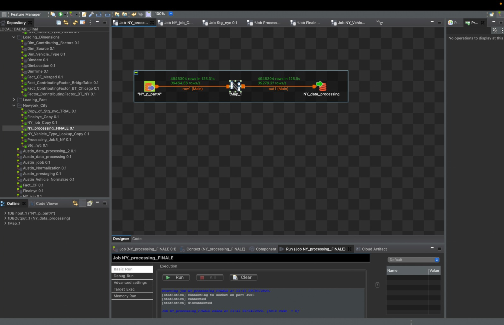

---

## Data Transformation Mapping

Each city's source columns were mapped to a harmonized target schema. Key transformations included date parsing, null handling, geographic type casting, contributing factor normalization, and vehicle type standardization.

### Austin Column Mapping

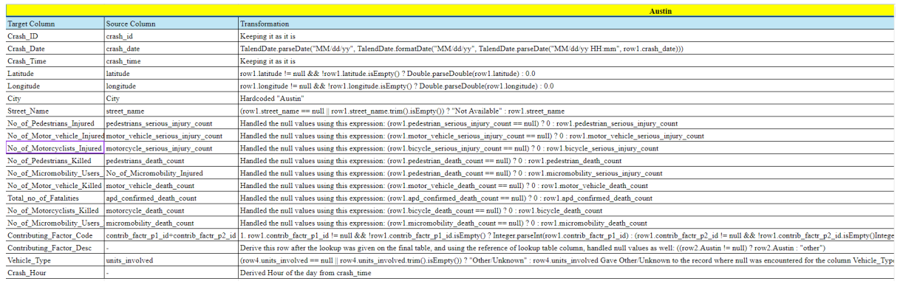

### Chicago Column Mapping

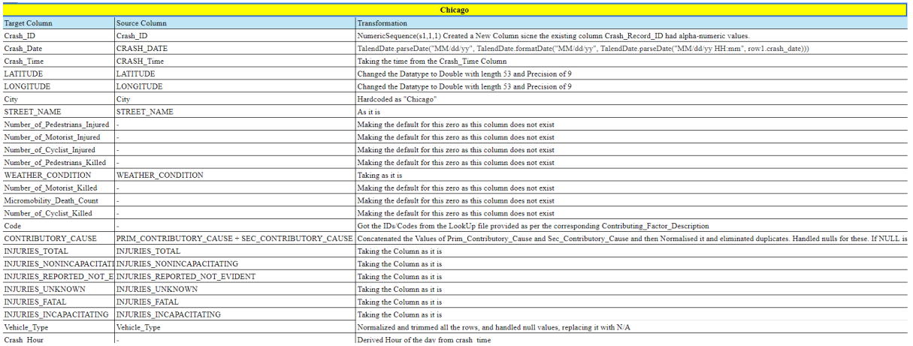

### New York City Column Mapping

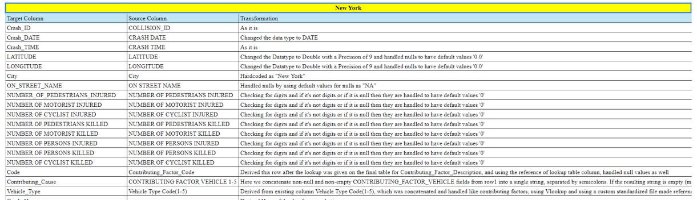

---

## Dimensional Model (Star Schema)

The warehouse uses a star schema centered on `AccidentEventsFactTable`, with five dimension tables and two bridge tables to handle many-to-many relationships for contributing factors and vehicle types.

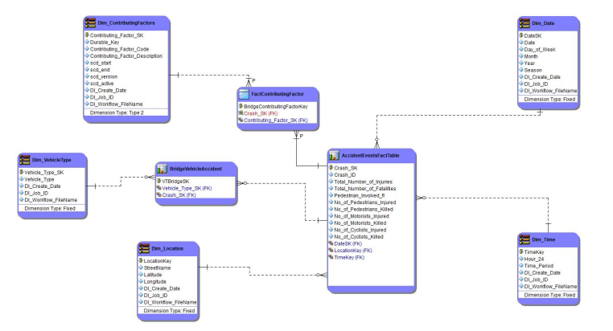

### Dimension Tables

| Table | Type | Description |
|---|---|---|
| `Dim_ContributingFactors` | Type 2 SCD | Contributing factor codes with full change history tracked via `scd_start`, `scd_end`, `scd_version`, `scd_active` |
| `Dim_VehicleType` | Fixed | Standardized vehicle type classifications |
| `Dim_Location` | Fixed | Street name, latitude, longitude |
| `Dim_Date` | Fixed | Date, day of week, month, year, season |
| `Dim_Time` | Fixed | Hour (24h) and time period |

### Fact & Bridge Tables

| Table | Description |
|---|---|
| `AccidentEventsFactTable` | Central fact table — injuries, fatalities, pedestrian/motorist/cyclist counts, FK links to all dimensions |
| `BridgeVehicleAccident` | Many-to-many bridge between crashes and vehicle types |
| `FactContributingFactor` | Bridge linking contributing factor dimension to crash events |

### DDL Summary

```sql
-- Central fact table
CREATE TABLE AccidentEventsFactTable (
    Crash_SK INT PRIMARY KEY,
    Crash_ID VARCHAR(255),
    Total_Number_of_Injuries INT,
    Total_Number_of_Fatalities INT,
    Pedestrian_Involved_fl BIT,
    No_of_Pedestrians_Injured INT,
    No_of_Pedestrians_Killed INT,
    No_of_Motorists_Injured INT,
    No_of_Motorists_Killed INT,
    No_of_Cyclists_Injured INT,
    No_of_Cyclists_Killed INT,
    DateSK INT,
    LocationKey INT,
    TimeKey INT,
    FOREIGN KEY (DateSK) REFERENCES Dim_Date(DateSK),
    FOREIGN KEY (LocationKey) REFERENCES Dim_Location(LocationKey),
    FOREIGN KEY (TimeKey) REFERENCES Dim_Time(TimeKey)
);

-- Type 2 SCD dimension for contributing factors
CREATE TABLE Dim_ContributingFactors (
    Contributing_Factor_SK INT PRIMARY KEY,
    Durable_Key INT,
    Contributing_Factor_Code VARCHAR(255),
    Contributing_Factor_Description TEXT,
    scd_start DATE,
    scd_end DATE,
    scd_version INT,
    scd_active BIT,
    DI_Create_Date DATE,
    DI_Job_ID INT,
    DI_Workflow_FileName VARCHAR(255)
);
```

---

## Business Questions Addressed

| # | Question | Visualization |
|---|---|---|
| 1 | How many accidents occurred per city? | `accident-frequency-by-city.pbix` |
| 2 | Where are accident hotspots geographically? | `accident-hotspot-map.pbix` |
| 3 | How many accidents resulted in injuries (overall & by city)? | `injury-accidents-overall.pbix`, `injury-accidents-by-city.pbix` |
| 4 | How many accidents involved pedestrians (overall & by city)? | `pedestrian-accidents-overall.pbix`, `pedestrian-accidents-by-city.pbix` |
| 5 | When do most accidents occur (hour, day, month, season, year)? | `temporal-trends.pbix` |
| 6 | What are motorist injury and fatality rates? | `motorist-injuries-fatalities.pbix` |
| 7 | Which streets have the most accidents? | `top-accident-streets.pbix` |
| 9 | How are fatalities distributed across road user types? | `fatalities-by-road-user-type.pbix` |
| 10 | What are the most common contributing factors? | `contributing-factors-analysis.pbix` |
| 11 | How many crashes involved more than two vehicle types? | `multi-vehicle-crashes.pbix` |

---

## Tools & Technologies

| Layer | Technology |
|---|---|
| Data Profiling | ydata-profiling (Python) |
| ETL | Talend Cloud Data Fabric 8.0.1 (Java) |
| Database | SQL Server |
| Data Modeling | ER/Studio (`.DM1`) |
| Visualization | Power BI, Tableau |

---

## Team

Group 14 — Prasad Gavas, Shantanu Mahakal, Prarthana Shetty, Soham Shah